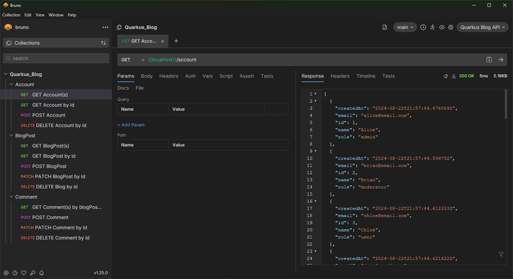

# Blog Project - Java Backend
This is my school project, that is part of the "Distributed Systems" course from the third year of study at the HFTM in Grenchen.
The goal is to build up a web-api backend, which I can utilise and extend in future courses. 

As for now, the application allows the user to create, view and edit blog entries via http requests.

This project uses the java framework Quarkus.

> [!IMPORTANT]
> Please Simeon have mercy when grading this. I just don't have enough time right now. I have redone this project 3 times now but I still encounter so many error. When I fix something, new problems emerge and nothing works anymore. I then spend hours fixing just one problem. Without an example project, iterating on this is almost impossible. As for now, hibernate at startup throws an error because quarkus can't drop the old tables while initializing due to DB relations, and the comments aren't working anymmore for whatever reason. I have tzried writing tests but since I have to change the project all the time, I can't reliably make tests right now. 
I am sorry. I can physically not invest more time for the school, even if I wanted. I have been permanently working on school stuff since the second week of July. I haven't had more than a couple hours of free time since then and I am working every day until midnight or even 1 o'clock in the morning on school projects. Together with my job, I am currently working for 15ish hours every single day since almost two months. 


## Table of Contents
- [Important files](#important-files)
- [Quarkus](#quarkus)
    - [Running the application in dev mode](#running-the-application-in-dev-mode)
    - [Accessing the Webview](#accessing-the-webview)
    - [Packaging and running the application](#packaging-and-running-the-application)
    - [Creating a native executable](#creating-a-native-executable)
    - [Related Guides and Links](#related-guides-and-links)
- [Roles](#roles)
- [HTTP Request Examples](#http-request-examples)
    - [Account](#account)
        - [GET Account(s)](#get-accounts)
        - [GET Account by id](#get-account-by-id)
        - [POST Account](#post-account)
    - [BlogPost](#blogpost)
        - [GET BlogPost(s)](#get-blogposts)
        - [GET BlogPost by id](#get-blogpost-by-id)
        - [POST BlogPost](#post-blogpost)
        - [PATCH BlogPost](#patch-blogpost)
        - [DELETE BlogPost](#delete-blogpost)
    - [Comment](#comment)
        - [GET Comment(s) by blogPostId](#get-comments-by-blogpostid)
        - [POST Comment by blogPostId](#post-comment-by-blogpostid)
        - [PATCH Comment by blogPostId](#patch-comment-by-blogpostid)
        - [DELETE Comment](#delete-comment)
- [Administrative](#administrative)
    - [Grading](#grading)
    - [Roadmap](#roadmap)
- [Useful subsidiary tools](#useful-subsidiary-tools)
- 

# Important files
[Troubleshooting guide](./markdown/troubleshooting-guide.md)

[Notebook](./markdown/logs.md)

[Bugs](./markdown/errors.md)

# Quarkus

### Running the application in dev mode
To run the application in dev mode, run the following command in the terminal from the root of the project. Dev mode enables live coding.
```shell script
./mvnw quarkus:dev
```
If the previous command is not working:
```shell script
./mvnw compile quarkus:dev
```

## Accessing the Webview
After the project has been started, the following two links should be accessible:

**Dev UI:**         http://localhost:8080/q/dev/

**Swagger UI:**    http://localhost:8080/q/swagger-ui/

## Packaging and running the application

The application can be packaged using:
```shell script
./mvnw package
```
It produces the `quarkus-run.jar` file in the `target/quarkus-app/` directory.
Be aware that it’s not an _über-jar_ as the dependencies are copied into the `target/quarkus-app/lib/` directory.

The application is now runnable using `java -jar target/quarkus-app/quarkus-run.jar`.

If you want to build an _über-jar_, execute the following command:
```shell script
./mvnw package -Dquarkus.package.type=uber-jar
```

The application, packaged as an _über-jar_, is now runnable using `java -jar target/*-runner.jar`.

## Creating a native executable

You can create a native executable using: 
```shell script
./mvnw package -Dnative
```

Or, if you don't have GraalVM installed, you can run the native executable build in a container using: 
```shell script
./mvnw package -Dnative -Dquarkus.native.container-build=true
```

You can then execute your native executable with: `./target/blogproject-1.0.0-SNAPSHOT-runner`

## Related Guides and Links

- **Quarkus Website:** https://quarkus.io/

- **REST JSON-B serialization support for Quarkus REST:**  https://quarkus.io/guides/rest#json-serialisation

- **Easily start your REST Web Services:** https://quarkus.io/guides/getting-started-reactive#reactive-jax-rs-resources

- **Building native executables:** https://quarkus.io/guides/maven-tooling


# Roles
There are currently four different roles.
1. Unauthenticated = Can GET BlogPosts, Accounts and Comments.
2. User = Same as unauthenticated + can POST BlogPosts and Comments
3. Moderator= Same as User + can DELETE, PUT and PATCH BlogPosts and Comments.
4. Admin = Same as moderator + can POST, PATCH, DELETE Accounts.

# HTTP Request Examples
Once the application is running, following http requests are possible:

How to test: Do you know the API Client bruno? It is amazing. 

<!-- 
| Entity | Type | Command | Description |
| --- | --- | --- | --- |
| Blog | GET | ```http GET http://localhost:8080/blogs``` | Lists all blogs, 4 per page |
| Blog | GET | ```http GET http://localhost:8080/blogs?page=2``` | List all blogs, page 2 |
| Blog | GET | ```http GET http://localhost:8080/blogs/1``` | List blog with id 1 |
| Blog | POST | ```http POST http://localhost:8080/blogs title="New Blog" content="This blog is new!"```| Post new blog with title and content (title and content required) |
| Blog | DELETE | ```http DELETE http://localhost:8080/blogs/1``` | Delete blog with the id 1 (id required) |
| Blog | PUT | ```http PUT http://localhost:8080/blogs/1 title="This blog was replaced" content="This content was replaced"``` | Replace blog with id 1 (id, title content required) |
| Blog | PATCH | ```http PATCH http://localhost:8080/blogs/1 content="This content was replaced"```  | Replace attributes of blog with id 1 (id required. Empty "" or null attributesare ignored) |
| Comment | GET | ```http GET http://localhost:8080/blogs/1/comments``` | Lists all comments on blog with id 1, 10 per page |
| Comment | GET | ```http GET http://localhost:8080/blogs/1/comments?page=2``` | Lists all comments on blog with id 1, page 2 |
| Comment | POST | ```http GET http://localhost:8080/blogs/1/comments content="This is a comment"``` | Post new comment on blog with id 1 with content (content required) | -->
## Authentication OAUTH 2.0
To get access tokens, you can send a GET request at the following access token URL:
```
http://localhost:8088/realms/blog/protocol/openid-connect/token
```
**Username, Password, Role:**

alice, alice, admin

bob, bob, moderator

carl, carl, user

**Client ID:**

backend-service

**Client Secret:**

secret


## Account

### GET Account(s)

**Roles:** @PermitAll

**URL:** http://localhost:8080/account

**Header**
```
-
```

**Body**
```
-
```

**Response Example**
```
[
  {
    "createdAt": "2024-08-22T21:57:44.474069Z",
    "email": "alice@email.com",
    "id": 1,
    "name": "Alice",
    "role": "admin"
  },
  {
    "createdAt": "2024-08-22T21:57:44.59975Z",
    "email": "brian@email.com",
    "id": 2,
    "name": "Brian",
    "role": "moderator"
  }
]
```

### GET Account by id

**Roles:** @PermitAll

**URL:** http://localhost:8080/account/1

**Header**
```
-
```

**Body**
```
-
```

**Response Example**
```
{
  "createdAt": "2024-08-22T21:57:44.474069Z",
  "email": "alice@email.com",
  "id": 1,
  "name": "Alice",
  "role": "admin"
}
```

### POST Account

**Roles:** @RolesAllowed("admin")

**URL:** http://localhost:8080/account

**Header**
```
Authorization: Bearer TOKEN
```

**Body**
```
{
  "name": "Bruno 1",
  "email": "bruno1@email.com"
}
```

**Response Example**
```
201 Created
```

<!-- ### DELETE (wip, problems with foreign key)

**Roles:** @RolesAllowed("admin")

**URL:** http://localhost:8080/account/1

**Header**
```
Authorization: Bearer TOKEN
```

**Body**
```
```

**Response Example**
```
``` -->

## BlogPost

### GET BlogPost(s)

**Roles:** @PermitAll

**URL:** http://localhost:8080/blogpost

**Header**
```
```

**Body**
```
```

**Response Example**
```
[
  {
    "accountId": 1,
    "accountName": "Alice",
    "content": "Content of initial BlogPost 1",
    "createdAt": "2024-08-22T21:57:44.675696Z",
    "id": 1,
    "title": "Initial BlogPost 1"
  },
  {
    "accountId": 2,
    "accountName": "Brian",
    "content": "Content of initial BlogPost 2",
    "createdAt": "2024-08-22T21:57:44.694639Z",
    "id": 2,
    "title": "Initial BlogPost 2"
  }
]
```

### GET BlogPost by id

**Roles:** @PermitAll

**URL:** http://localhost:8080/blogpost/1

**Header**
```
```

**Body**
```
```

**Response Example**
```
{
"accountId": 1,
"accountName": "Alice",
"content": "Content of initial BlogPost 1",
"createdAt": "2024-08-22T21:57:44.675696Z",
"id": 1,
"title": "Initial BlogPost 1"
}
```

### POST BlogPost
**Roles:** @RolesAllowed({"admin", "moderator", "user"})

**URL:** http://localhost:8080/blogpost

**Header**
```
accountID: 1
Authorization: Bearer TOKEN
```

**Body**
```
{
  "title": "Brunos BlogPost 1",
  "content": "Bruno says hi",
  "accountId": "1"
}
```

**Response Example**
```
201 Created
```

### PATCH BlogPost

**Roles:** @RolesAllowed({"admin", "moderator", "user"})

**URL:** http://localhost:8080/blogpost/1

**Header**
```
Authorization: Bearer TOKEN
```

**Body**
```
{
  "content": "Bruno replaced this content"
}
```

**Response Example**
```
200 OK
```

### DELETE BlogPost

**Roles:** @RolesAllowed({"admin", "moderator", "user"})

**URL:** http://localhost:8080/blogpost/1

**Header**
```
Authorization: Bearer TOKEN
```

**Body**
```
```

**Response Example**
```
200 OK
```

## Comment

### GET Comment(s) by blogPostId

**Roles:** @PermitAll

**URL:** http://localhost:8080/comment/1

**Header**
```
```

**Body**
```
```

**Response Example**
```
[
  {
    "accountId": 3,
    "blogPostId": 1,
    "changedAt": "2024-08-22T21:35:17.376448Z",
    "content": "Comment 3 on BlogPost 1",
    "createdAt": "2024-08-22T21:35:17.376448Z",
    "id": 3
  },
  {
    "accountId": 4,
    "blogPostId": 1,
    "changedAt": "2024-08-22T21:35:17.392654Z",
    "content": "Comment 4 on BlogPost 1",
    "createdAt": "2024-08-22T21:35:17.392654Z",
    "id": 4
  }
]
```

### POST Comment by blogPostId

**Roles:** @RolesAllowed({"admin", "moderator", "user"})

**URL:** http://localhost:8080/comment/1

**Header**
```
Authorization: Bearer TOKEN
```

**Body**
```
{
  "content": "This is a new comment"
}
```

**Response Example**
```
{
  "accountId": 1,
  "blogPostId": 1,
  "changedAt": "2024-08-22T23:27:36.4742385+02:00[Europe/Zurich]",
  "content": "This is a new comment",
  "createdAt": "2024-08-22T23:27:36.4742385+02:00[Europe/Zurich]",
  "id": 102
}
```

### PATCH Comment by blogPostId

**Roles:** @RolesAllowed({"admin", "moderator", "user"})

**URL:** http://localhost:8080/comment/1

**Header**
```
commentId: 1
Authorization: Bearer TOKEN
```

**Body**
```
{
  "content": "This comment was replaced"
}
```

**Response Example**
```
{
  "accountId": 1,
  "blogPostId": 1,
  "changedAt": "2024-08-22T21:57:44.749259Z",
  "content": "Comment 1 on BlogPost 1",
  "createdAt": "2024-08-22T21:57:44.749259Z",
  "id": 1
}
```

### DELETE Comment

**Roles:** @RolesAllowed({"admin", "moderator", "user"})

**URL:** http://localhost:8080/comment

**Header**
```
commentId: 1
Authorization: Bearer TOKEN
```

**Body**
```
```

**Response Example**
```
200 OK
```


# Administrative
### Grading
The grading of this project will be done by collaborator simeonlin.
This project will be randomly sampled and graded after every tasks.
Each sample will be assessed according to the following scheme with a maximum of 4 points:
* Initial repository status / starting point before the last task (max. 2 points)
    * ✅ 2 points: Suitable project setup and evidence of initiative.
    * ☑️ 1 point: Suitable project setup, but little evidence of initiative. (e.g., Only commits with sample solutions)
    * ❌ 0 points: Starting point is incorrect.
* Last task (max. 2 points)
    * ✅ 2 points: Current task has been implemented or it is evident that the student has engaged appropriately with the current task.
    * ☑️ 1 point: Little effort towards the last task is evident.
    * ❌ 0 points: No effort towards the last task is evident.

### Roadmap
This list keeps track of currently open and completed tasks. 
- [x] PU 01 - Basic Setup
    - [x] Create a new private github Project
    - [x] Add simeonlin as a collaborator
    - [x] Push changes to main
- [x] PU 02 - Database Access
    - [x] Create a new Quarkus project
    - [x] Start and test the project
    - [x] Access the mysql docker database
- [x] PU 03 - HTTP Communication 1
    - [x] Implement http GET and POST
    - [x] Blog object class
    - [x] Usage of @Path parameters
- [x] PU 03 - HTTP Communication 2
    - [x] Generating Responses
    - [x] Exception Handling
- [x] PU 04 - HTTP Communication 3
    - [x] Implement http DELETE, PUT, PATCH
    - [x] Query and Header pareameters
- [x] PU 05 - HTTP Communication 4
    - [x] Validation
    - [x] Mapping with schematics
    - [x] Testing of API

# Useful subsidiary tools
- **Json Web Tokens:**    https://jwt.io/
- **Bruno API Client:**    https://www.usebruno.com/


<!-- # Authentication
Currently, because of time constraints, the authentication using keycload is not fully implemented. But in the future, I will implement the following roles.

- Admin: 
Has access to everything. Can get, post, patch or delete blogs, comments and other entities I may add. 
- User
Users require a login. They can get and post blogs and comments. They can patch and put the blogs and comments they created.
- Guest
A guest is a role that doesen't require an loging. They can only get blogs and comments. 
- Moderator
If the moderator role will exists depends on the time I have avaiable to test out and implement some features. If I have the time to also add user profile entities, I may also add an moderator. Unlike the administrator, who has no restrictions at all, a moderator can get and push all blogs and comments, but he can not alter them. Altering them is prohibited because if the moderator is malicious, he could make it looklike as a user wrote something that they did not. The moderator has also no access to modifying user profiles. 
 -->

