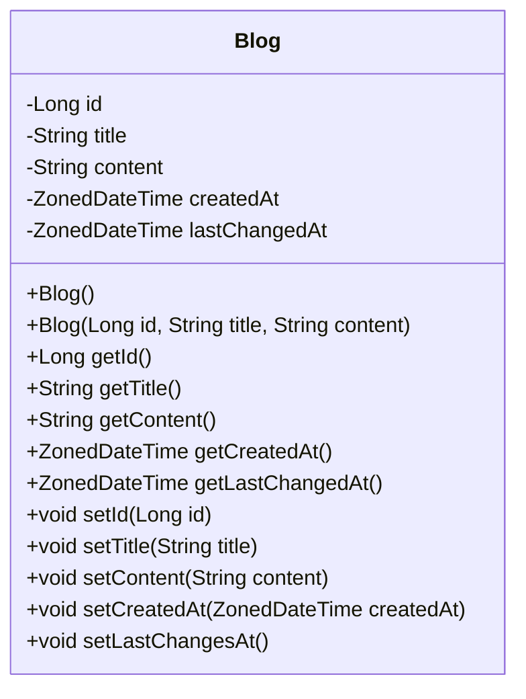
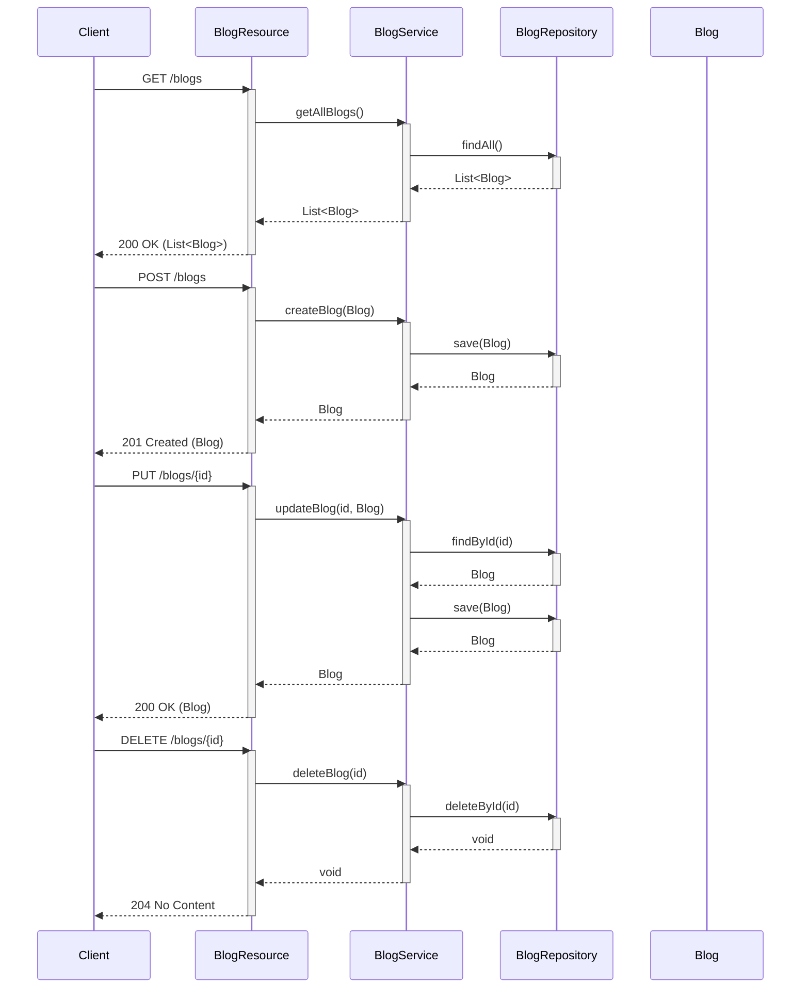

# BlogProject
This is my school project, that is part of the "Distributed Systems" course from the third year of study at the HFTM in Grenchen.
The goal is to build up a web-api backend, which I can utilise and extend in future courses. 

As for now, the application allows the user to create, view and edit blog entries via http requests.

This project uses the java framework Quarkus.

# Quarkus

### Running the application in dev mode
To run the application in dev mode, run the following command in the terminal from the root of the project. Dev mode enables live coding.
```shell script
./mvnw quarkus:dev
```
If the previous command is not working:
```shell script
./mvnw compile quarkus:dev
```

## Accessing the Webview
After the project has been started, the following two links should be accessible:

**Homepage:**       http://localhost:8080/hello

**Dev UI:**         http://localhost:8080/q/dev/

## Packaging and running the application

The application can be packaged using:
```shell script
./mvnw package
```
It produces the `quarkus-run.jar` file in the `target/quarkus-app/` directory.
Be aware that it’s not an _über-jar_ as the dependencies are copied into the `target/quarkus-app/lib/` directory.

The application is now runnable using `java -jar target/quarkus-app/quarkus-run.jar`.

If you want to build an _über-jar_, execute the following command:
```shell script
./mvnw package -Dquarkus.package.type=uber-jar
```

The application, packaged as an _über-jar_, is now runnable using `java -jar target/*-runner.jar`.

## Creating a native executable

You can create a native executable using: 
```shell script
./mvnw package -Dnative
```

Or, if you don't have GraalVM installed, you can run the native executable build in a container using: 
```shell script
./mvnw package -Dnative -Dquarkus.native.container-build=true
```

You can then execute your native executable with: `./target/blogproject-1.0.0-SNAPSHOT-runner`

## Related Guides and Links

- **Quarkus Website:** https://quarkus.io/

- **REST JSON-B serialization support for Quarkus REST:**  https://quarkus.io/guides/rest#json-serialisation

- **Easily start your REST Web Services:** https://quarkus.io/guides/getting-started-reactive#reactive-jax-rs-resources

- **Building native executables:** https://quarkus.io/guides/maven-tooling

# HTTP Request Examples
Once the application is running, following http requests are possible (Examples using httpie):

| Type | Command | Description |
| --- | --- | --- |
| GET | ```http GET http://localhost:8080/blogs``` | Lists all blogs, 4 per page |
| GET | ```http GET http://localhost:8080/blogs?page=2``` | List all blogs, page 2 |
| GET | ```http GET http://localhost:8080/blogs/1``` | List blog with id 1 |
| POST | ```http POST http://localhost:8080/blogs title="New Blog" content="This blog is new!"```| Post new blog with title and content (title and content required) |
| DELETE | ```http DELETE http://localhost:8080/blogs/1``` | Delete blog with the id 1 (id required) |
| PUT | ```http PUT http://localhost:8080/blogs/1 title="This blog was replaced" content="This content was replaced"``` | Replace blog with id 1 (id, title content required) |
| PATCH | ```http PATCH http://localhost:8080/blogs/1 content="This content was replaced"```  | Replace attributes of blog with id 1 (id required. Empty "" or null attributesare ignored) |

# Diagrams





# Administrative
### Grading
The grading of this project will be done by collaborator simeonlin.
This project will be randomly sampled and graded after every tasks.
Each sample will be assessed according to the following scheme with a maximum of 4 points:
* Initial repository status / starting point before the last task (max. 2 points)
    * ✅ 2 points: Suitable project setup and evidence of initiative.
    * ☑️ 1 point: Suitable project setup, but little evidence of initiative. (e.g., Only commits with sample solutions)
    * ❌ 0 points: Starting point is incorrect.
* Last task (max. 2 points)
    * ✅ 2 points: Current task has been implemented or it is evident that the student has engaged appropriately with the current task.
    * ☑️ 1 point: Little effort towards the last task is evident.
    * ❌ 0 points: No effort towards the last task is evident.

### Roadmap
### To-Do
This list keeps track of currently open and completed tasks. 
- [x] Basic Setup
    - [x] Create a new private github Project
    - [x] Add simeonlin as a collaborator
    - [x] Push changes to main
- [x] First Quarkus project
    - [x] Create a new Quarkus project
    - [x] Start and test the project
    - [x] Expand the project / Thinker around